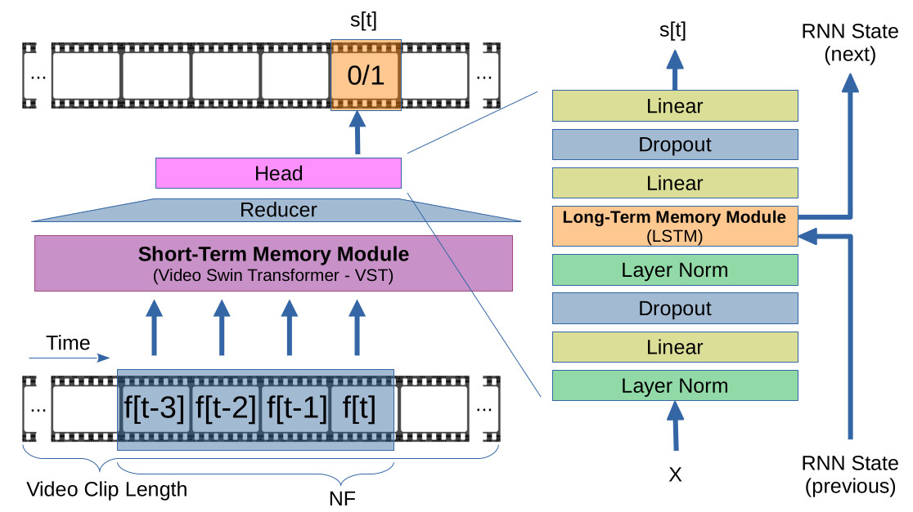

## [Memory-augmented Online Video Anomaly Detection (MOVAD)](https://arxiv.org/abs/2302.10719)

Official PyTorch implementation of **MOVAD**.

We propose **MOVAD**, a brand new architecture for online (frame-level) video
anomaly detection.



Authors: Leonardo Rossi, Vittorio Bernuzzi, Tomaso Fontanini,
         Massimo Bertozzi, Andrea Prati.

[IMP Lab](http://implab.ce.unipr.it/) -
Dipartimento di Ingegneria e Architettura

University of Parma, Italy


## Abstract

The ability to understand the surrounding scene is of paramount importance
for Autonomous Vehicles (AVs).

This paper presents a system capable to work in a real time guaranteed
response times and online fashion, giving an immediate response to the arise
of anomalies surrounding the AV, exploiting only the videos captured by a
dash-mounted camera.

Our architecture, called MOVAD, relies on two main modules:
a short-term memory to extract information related to the ongoing action,
implemented by a Video Swin Transformer adapted to work in an online scenario,
and a long-term memory module that considers also remote past information
thanks to the use of a Long-Short Term Memory (LSTM) network.

We evaluated the performance of our method on Detection of Traffic Anomaly
(DoTA) dataset, a challenging collection of dash-mounted camera videos of
accidents.

After an extensive ablation study, MOVAD is able to reach an AUC score of
82.11%, surpassing the current state-of-the-art by +2.81 AUC.


## Usage

###  Installation
```bash
$ git clone https://github.com/IMPLabUniPr/movad/tree/icip
$ cd movad
$ wget https://github.com/SwinTransformer/storage/releases/download/v1.0.4/swin_base_patch244_window1677_sthv2.pth -O pretrained/swin_base_patch244_window1677_sthv2.pth
$ conda env create -n movad_env --file environment.yml
$ conda activate movad_env
```

# Download DoTa dataset

Please download from [official website](https://github.com/MoonBlvd/Detection-of-Traffic-Anomaly)
the dataset and save inside `data/dota` directory.

You should obtain the following structure:

```
data/dota
├── annotations
│   ├── 0qfbmt4G8Rw_000306.json
│   ├── 0qfbmt4G8Rw_000435.json
│   ├── 0qfbmt4G8Rw_000602.json
│   ...
├── frames
│   ├── 0qfbmt4G8Rw_000072
│   ├── 0qfbmt4G8Rw_000306
│   ├── 0qfbmt4G8Rw_000435
│   .... 
└── metadata
    ├── metadata_train.json
    ├── metadata_val.json
    ├── train_split.txt
    └── val_split.txt
```

### Train
```bash
python src/main.py --config cfgs/v1_1.yml --output output/v1_1/ --phase train --epochs 100 --epoch -1
```

### Eval
```bash
python src/main.py --config cfgs/v1_1.yml --output output/v1_1/ --phase test --epoch 10
```

### Play: generate video
```bash
python src/main.py --config cfgs/v1_1.yml --output output/v1_1/ --phase play --epoch 100
```

## Results

### Table 1

Memory modules effectiveness.

| # | Short-term | Long-term | AUC | Conf |
|:---:|:---:|:---:|:---:|:---:|
| 1 |   |   | 66.53 | [conf](cfgs/v0_1.yml) |
| 2 | X |   | 74.46 | [conf](cfgs/v2_3.yml) |
| 3 |   | X | 68.76 | [conf](cfgs/v1_1.yml) |
| 4 | X | X | 79.21 | [conf](cfgs/v1_3.yml) |

### Figure 2

Short-term memory module.

| Name | Conf |
|:---:|:---:|
| NF 1 | [conf](cfgs/v1_1.yml) |
| NF 2 | [conf](cfgs/v1_2.yml) |
| NF 3 | [conf](cfgs/v1_3.yml) |
| NF 4 | [conf](cfgs/v1_4.yml) |
| NF 5 | [conf](cfgs/v1_5.yml) |

### Figure 3

Long-term memory module.

| Name | Conf |
|:---:|:---:|
| w/out LSTM     | [conf](cfgs/v2_1.yml) |
| LSTM (1 cell)  | [conf](cfgs/v2_2.yml) |
| LSTM (2 cells) | [conf](cfgs/v1_3.yml) |
| LSTM (3 cells) | [conf](cfgs/v2_3.yml) |
| LSTM (4 cells) | [conf](cfgs/v2_4.yml) |

### Figure 4

Video clip length (VCL).

| Name | Conf |
|:---:|:---:|
| 4 frames  | [conf](cfgs/v3_1.yml) |
| 8 frames  | [conf](cfgs/v1_3.yml) |
| 12 frames | [conf](cfgs/v3_2.yml) |
| 16 frames | [conf](cfgs/v3_3.yml) |

### Table 2

Comparison with the state of the art.

| # | Method | Input | AUC | Conf |
|:---:|:---:|:---:|:---:|:---:|
| 9  | Our (MOVAD) | RGB (320x240) | 80.09 | [conf](cfgs/v4_1.yml) |
| 10 | Our (MOVAD) | RGB (640x480) | 82.17 | [conf](cfgs/v4_2.yml) |

## License

See [GPL v2](./LICENSE) License.

## Acknowledgement

This research benefits from the HPC (High Performance Computing) facility
of the University of Parma, Italy.

## Citation
If you find our work useful in your research, please cite:

```
@misc{https://doi.org/10.48550/arxiv.2302.10719,
  doi = {10.48550/ARXIV.2302.10719},
  url = {https://arxiv.org/abs/2302.10719},
  author = {Rossi, Leonardo and Bernuzzi, Vittorio and Fontanini, Tomaso and Bertozzi, Massimo and Prati, Andrea},
  keywords = {Computer Vision and Pattern Recognition (cs.CV), Artificial Intelligence (cs.AI), FOS: Computer and information sciences, FOS: Computer and information sciences, F.1.1, 68-02, 68-04, 68-06, 68T07, 68T10, 68T45},
  title = {Memory-augmented Online Video Anomaly Detection},
  publisher = {arXiv},
  year = {2023},
  copyright = {Creative Commons Attribution Share Alike 4.0 International}
}
```
